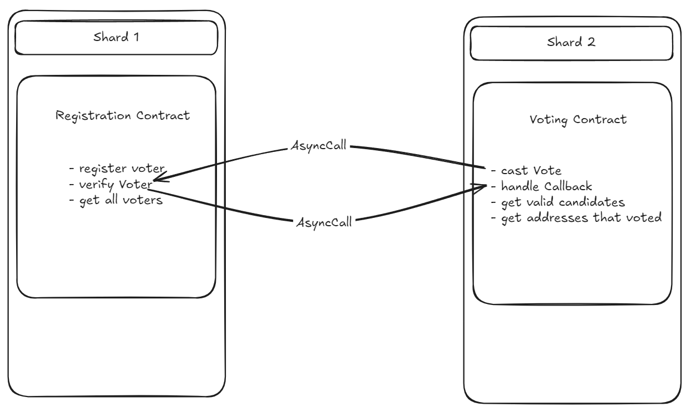

# Voting dApp

This is a sample repository for deploying your own voting dApp on top of the devnet. In this repository we will be building 2 different smart contracts namely: `RegistrationContract` and `VotingContract`. The `RegistrationContract` is responsible for registering the voters and the `VotingContract` is responsible for casting the votes.

We will be deploying these into 2 different shards, enable async communication between them and see how to call various methods of the contracts via the existing developer tools like `niljs` and `hardhat`.

## Basic Workflow:
In the workflow of this dApp, we are going to demonstrate a simple voting system where the voters are first registered on the `RegistrationContract` and then they can cast their votes on the `VotingContract`. The flowchart below shows how the contracts interact with each other.



The `RegistrationContract` has a method `registerVoter` which takes the voter's address as an argument and registers the voter. The `VotingContract` has a method `castVote` which takes the voter's address and the candidate's name as arguments and casts the vote. The `castVote` method uses the `asyncCall` method derived from the `Nil.sol`. `Nil.sol` is a solidity library that lets you build asynchronous contracts on top of the network.

The `castVote` method, using asyncCall will send a message to the `RegistrationContract` to invoke the `verifyVoter` function with arguments of address(`msg.sender`) and candidateId. This function searches for the voter in the list of registered voters and returns a boolean value. =Then `verifyVoter` calls back the `VotingContract` using asyncCall to invoke the `handleCallback` function with the arguments of boolean value(corresponsing to the voter registration), the candidateId and the address of the voter received. The `handleCallback` function, based on the boolean value, will update a vote for that particular candidate.If the boolean value is false, the vote will not be counted.

## Prerequisites
It  would be helpful to install the CLI as this will help us down the line to debug our interaction in case anything goes wrong.

### Installation:

```bash
curl -fsSL https://github.com/NilFoundation/nil_cli/raw/master/install.sh | bash
```

For further instructions on how to set it up, please refer to the docs [here](https://docs.nil.foundation/nil/tools/nil-cli/usage/)

Also, recommended usage of `bun` runtime environment for running the `niljs` files. To install bun:
```bash
npm install -g bun
```

## Configuring the initial setup

- Clone the repository and navigate to the root directory of the project.
```bash
git clone https://github.com/gitshreevatsa/Voting-dapp.git
```
- To install the dependencies, run the following command:
```bash
npm install
```
- Create a `.env` file in the root directory and add the following variables:
```bash
NIL_RPC_ENDPOINT=<NIL_RPC_ENDPOINT>
PRIVATE_KEY=<PRIVATE_KEY>
WALLET_ADDR=<WALLET_ADDR>
```

This project is setup to use the hardhat plugin. The hardhat config is already setup to support the network.

## Deployment
Once you have finished the setup, lets get started with the deployment of the contracts. Here we will be compiling the contracts and deploying only the `RegistrationContract` via hardhat. The `VotingContract` will be deployed via the `niljs`.
- To compile the contracts, run the following command:
```bash
npx hardhat compile
```
For the sake of easy access, this repository has the compiled output, containing the abi and bytecode inside the `/public` folder.

- To deploy the `RegistrationContract`, run the following command:
```bash
npx hardhat ignition deploy ./ignition/modules/RegistrationContract.ts --network nil
```
- Now lets deploy the `Voting Contract`, if you would like to change the candidateIds then you can change it in the `candidateIds` array(the contract currently accepts only `uint256` for candidateIds) of thr file `./niljs/deployVotingContract.ts`. To deploy the `VotingContract` using `niljs`, run the following command:
```bash
bun run ./niljs/deployVotingContract.ts
```

## Interaction
Now as the contracts are deployed, we need to register a voter. To register a voter, run the following command:
```bash
bun run ./niljs/callRegistrationContract.ts
```

After registering the voter, take the `private key` and `wallet address` that is logged in the console and add it in the respective placeholders of the `/niljs/callVotingContract.ts` file. We do this because, we want the registered voter of  the previous step to be calling the `castVote` function for casting a vote. If you want to change the candidateId you can do so by changing the `args` parameter inside the variable `sendingVote`.

Now to cast a vote, run the following command:
```bash
bun run ./niljs/callVotingContract.ts
```


Finally to see the number of votes each candidate has recieved, we run the hardhat task:
```bash
npx hardhat results --contract <CONTRACT ADDRESS> --candidateid <CANDIDATE ID> --network nil
```
This should fetch you a result of type(1 if you have voted for the candidate, 0 if you have not voted for the candidate):
```bash
Result: 1n
```

## Debugging
If you face discrepencies while interacting with the contracts, you can debug them using `nil` CLI. You can check the contract code, balance, receipt etc.
- To check if your contracts are deployed or not:
```bash
nil contract code <CONTRACT_ADDRESS>
```
- To check the balance of the contract:
```bash
nil contract balance <CONTRACT_ADDRESS>
```
- To check the receipt of the message hash:
```bash
nil receipt <MESSAGE_HASH>
```
- To top up your contract balance, for any `OutOfGas` errors, it is recommended to top up your contracts with some native tokens. For doing so, run the following commands:
```bash
nil wallet send-tokens <CONTRACT_ADDRESS> <AMOUNT>
```
The above command expects you already have your CLI wallet setup. If not, please check the docs [here](https://docs.nil.foundation/nil/tools/nil-cli/usage/)(The same one as the one in prerequisites).

## Conclusion
Congrats! You have deployed your own voting dApp on the devnet and made your foorptints onto the zkSharding ecosystem. You can further extend this dApp by adding more features as you like. You can also contribute to the existing codebase by raising a PR to this repository.Would love to see your contributions.

As I beleive, the world's problems are not solveable by a single distributed compouter, hence long live sharding and asynchronously programmed contracts!
